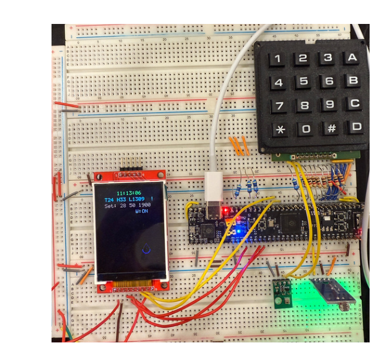
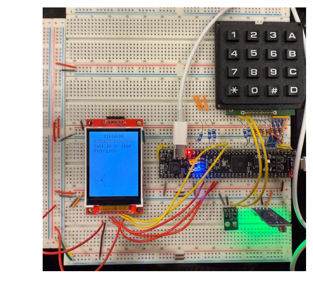
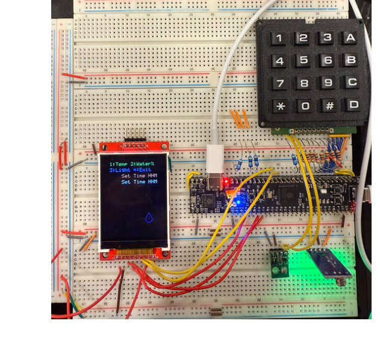

# Embedded Environmental Control System

An embedded environmental monitoring and control system built on an RP2350-based board (PlatformIO `proton` target, Pico SDK). It continuously senses temperature, humidity, and ambient light, then drives a fan, a water-level indicator, an RGB status LED, and an adaptive display backlight in response to configurable thresholds.

## Hardware Demo

| Live monitoring | Fan / backlight alert | Threshold configuration menu |
|---|---|---|
|  |  |  |

## Features

- **Sensing**
  - Temperature and humidity via an AHT20 sensor over I2C
  - Ambient light level via an LDR on an ADC input, with exponential filtering to smooth readings
- **Actuation**
  - Fan control triggered when temperature exceeds a configurable threshold
  - Water-level warning indicator triggered when humidity drops below a configurable threshold
  - RGB LED brightness that continuously adapts to ambient light (auto-dimming)
  - Display backlight brightness that adapts to ambient light via PWM
- **Display / UI**
  - Custom SPI driver for an ILI9341 TFT display, including a hand-written bitmap font renderer and vector graphics (fan/water-drop icons)
  - Live status shown on-screen: clock, temperature, humidity, light level, and active alerts
  - Matrix keypad input for setting the system clock and configuring thresholds (temperature, humidity, light) through an on-device menu
- **Timekeeping**: software real-time clock driven by a repeating hardware timer
- **Input handling**: timer-interrupt-driven keypad matrix scanning with debouncing, feeding a producer/consumer event queue shared with the main loop

## Hardware / Platform

- Board: RP2350 (`proton`, via PlatformIO `platform-raspberrypi` with Pico SDK framework)
- Sensors: AHT20 (I2C temperature/humidity), LDR (ADC light sensor)
- Outputs: SPI ILI9341 TFT display, RGB LED (PWM), fan and water-indicator digital outputs

## Building

This project uses [PlatformIO](https://platformio.org/). With PlatformIO installed:

```bash
pio run
```

See `platformio.ini` for the board and framework configuration.

## Contributors

Team project, originally developed as an ECE 362 mini-project at Purdue University:

- **Jensen Wang (王子宸)** — TFT display driver (SPI, custom font renderer, graphics); full system integration, wiring together sensor input, keypad input, and display/actuator output into the final application
- **Corrine Tseng, Aimee Chiu, Derek Liu** — individual sensor module development and hardware bring-up
